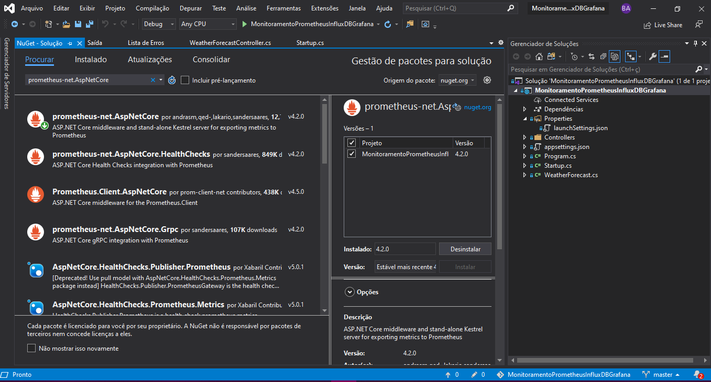
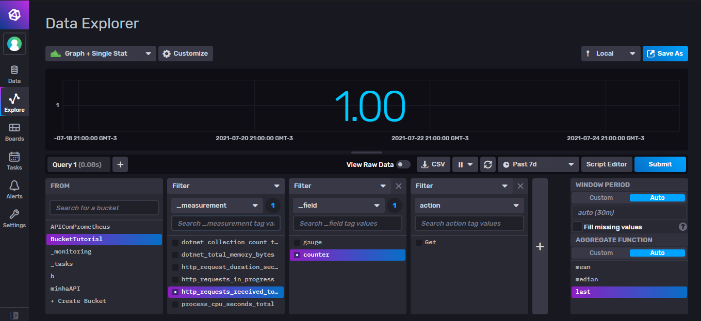
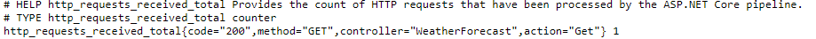

# Obsevabilidade em APIs ASP.NET core


## Ferramentas utilizadas:

- Asp.Net core 3.1
- [prometheus-net](https://github.com/prometheus-net/prometheus-net)
- [InfluxDB](https://docs.influxdata.com/influxdb/v2.0/)
- [Grafana](https://grafana.com/docs/grafana/latest/getting-started/getting-started/)

## Introdução
  Para este tutorial será construido apenas uma API com Asp.net core que contém um controller, ou seja, o foco desse tutorial é como adicionar um coletor de métricas na sua API. Neste tutorial todas as ferramentas serão instaladas localmente sem uso de Docker.
  
## InfluxDB
  O InfluxDB é um banco de dados (TSDB) usado para armazenar registros onde a data e hora em que eles foram armazenados são relevantes para algum tipo de análise, portanto o InfluxDB é usado para armazenar métricas de servidor, monitoramento de desempenho de aplicativos, dados de rede, dados de sensores, eventos, negociações em um mercado e outros tipos de dados analíticos. Ele possui uma linguagem própria chamada Influx que se utiliza do paradigma funcional e oferece várias funções para manipular e analisar dados.
  O InfluxDB pode ser usado com Docker ou instalando o banco de dados na sua máquina. Para instalar o InfluxDB basta baixar o pacote comprimido no site [InfluxData](https://docs.influxdata.com/influxdb/v2.0/install/?t=Windows#download-and-install-influxdb-v20) e descomprimir na pasta ```C:\Program Files\InfluxData\```, após isso basta abrir o terminal do seu computador e rodar o binário do banco de dados.
  
  ```bash
  cd "C:\Program Files\InfluxData\"
  ./influxd
  ```
  
  Após isso você consegue acessar a UI do influxDB que fica por padrão no endereço ```http://localhost:8086```.
  
  ## Grafana
  O grafana é uma aplicação de código aberto onde é possível criar dashboards que refletem os dados que estão em alguma fonte de dados que você especifica. Ele pode ser usado de duas formas: como container Docker ou instalar localmente. Para instalar basta entrar no [site do Grafana](https://grafana.com/grafana/download?platform=windows) e selecionar o seu sistema operacional. Se você estiver no windows baixe o arquivo .msi e siga o instalador. Após finalizar a instalação o servidor do grafana ja estará rodando na porta 3000 ```http://localhost:3000```.
  
  ## API Asp.Net Core 3.1
  Aqui será usado Visual Studio 2019. Crie uma API Asp.Net Core 3.1 com os seguintes passos:
  - Selecione a opção **Criar um projeto**
  - Selecione o projeto **Aplicativo Web ASP.NET Core** e dê o nome que desejar

  Após essa criação adicione o seguinte pacote [prometheus-net.AspNetCore](https://github.com/prometheus-net/prometheus-net)
  Se você não sabe instalar um pacote segue as instruções:
  - Selecione a opção **Ferramentas** > **Gerenciador de pacotes do NuGet** > **Gerenciar pacotes do NuGet para a Solução**
  - Na janela que irá abrir selecione a aba **Procurar** e digite o nome do pacote.
  - Após encontrar o pacote selecione ele e instale na sua solução.
  
  
  
  Após fazer isso basta você adicionar o middleWare do prometheus para expor as metricas da sua API no endpoint ```/metrics```. O ```app.UseHttpMetrics()``` deve ser posto após ```app.UseRouting()````.
  
  ```C#
  public void Configure(IApplicationBuilder app, IWebHostEnvironment env)
  {
     ...
     app.UseRouting();
     app.UseHttpMetrics();
     
     app.UseEndpoints(endpoints =>
      {
          endpoints.MapControllers();
          endpoints.MapMetrics();
      });
  }  
```
  
  Quando você rodar a sua API e consultar o endpoint ```/metrics``` verá o seguinte resultado:
  
  
  
  ## Salvando as métricas no InfluxDB
  O InfluxDB tem os buckets que são onde as métricas são armazenadas, porém com Asp.net core você só tem ferramentas/pacotes que te possibilitam escrever e consultar esse bucket não tem um pacote que colete e insira os dados diretamente no bucket. Para isso o InfluxDB também oferece os scrapers que são coletores que coletam dados de um endpoint que você informa e que expõe as métricas no [padrão de escrita Prometheus](https://prometheus.io/docs/instrumenting/exposition_formats/). Esses Scrapers ficam varrendo o endpoint que você informou e guarda os dados que encontra no bucket que você informou.
  Para utilizar o Scrapper você precisa:
- Criar um bucket
- Criar um Scraper

Se você não souber como criar assista o video.
  [Criando buckets e scrapers](https://www.loom.com/share/c2c452df29414344b67c7ad470ebdabc)

Vale ressaltar que na opção "Target URL" para criar o scraper você deve informar o endpoint de métricas da sua API.
Após isso você quando você rodar a sua API e começar a fazer requisições para ela os dados vão começar a serem inseridos nos buckets e você vai poder visualizar que eles estão sendo salvos você pode ir na opção **Explore**



## Criando Dashboard no Grafana
Depois de ter instalado o grafana você deve acessar o endereço ```http://localhost:3000```, fazer login e começar os preparativos para visualizar os seus dados que estão armazenados no InfluxDB. Para isso você deve:

- Adicionar a fonte de dados do InfluxDB
- Criar o Dashboard de forma que cada quadro represente uma query ao Bucket

Assista o [vídeo](https://www.loom.com/share/ecfab9b189d24a79a2fb48fb3faf78d9) para saber como fazer os dois passos anteriores.

Uma informação que acho relevante citar aqui é: você pode verificar os tipos de dados disponibilizados pela ferramenta prometheus-net.AspNetCore olhando o seu endpoint ```/metrics```. Cada métrica tem um breve resumo com a sua descrição (#HELP) e tipo (#TYPE).


  
  
